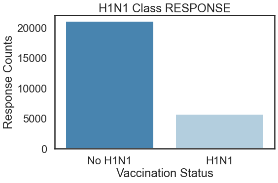
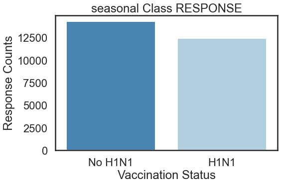
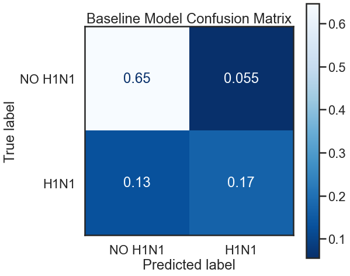
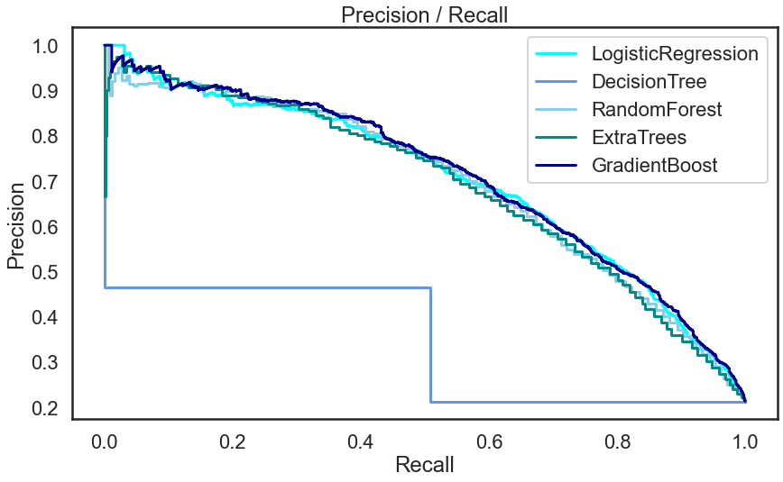

# Vaccination_prediction Machine Learning Model
This dataset comes from the Driven Data competition "Flu Shot Learning: Predict H1N1 and Seasonal Flu Vaccines".

### Busines Understanding
The Lowest seasons of  human kind  are those of global health  pandemics with the  most recent being Covid _19.Preceeded by the other influenza viruses the H1 _N1 and the seasonal flu.According to the World Health Organization , There are around a billion cases of seasonal influenza annually, including 3–5 million cases of severe illness.
It causes 290 000 to 650 000 respiratory deaths annually.
Ninety-nine percent of deaths in children under 5 years of age with influenza-related lower respiratory tract infections are in developing countries https://www.who.int/news-room/fact-sheets/detail/influenza-(seasonal)?gad_source=1&gclid=EAIaIQobChMIm-y9mLnAhgMV5KmDBx1GgwYuEAA

The flu and H1N1 vaccination rate in the United States is relatively low at 50.2%. This presents a public 
health concern, particularly given the high availability and proven effectiveness of flu vaccines.As the world struggles to vaccinate the global population against COVID-19, an understanding of how people’s backgrounds, opinions, and health behaviors are related to their personal vaccination patterns can provide guidance for future public health efforts.

Understanding these factors and modelling them  as a data scientist will be pertinent in infroming  the the public health stakeholders in the  the World Health Organization.

### Problem Statement
 The goal is to determine the most effective behaviors that lead people to get vaccinated against the H1N1 flu virus and seasonal flu viruses. This involves identifying key factors that influence behavior and motivations, such as education, age, employer influence, health insurance, physician recommendations, presence of chronic diseases, and employment in the healthcare sector. Additionally, vaccination status may be affected by behaviors like face-touching, attending large gatherings, wearing masks, and hand-washing habits.

The primary objective of this algorithm is classification. It should analyze attributes from the National 2009 H1N1 Flu and Seasonal Flu Survey dataset to determine if a respondent received the seasonal flu vaccine or the H1N1 flu vaccine. The model's effectiveness will be measured by how accurately it predicts vaccination status based on the respondent's behaviors and motivational factors.

### Objectives
.To determine whether opinion is  associated with higher vaccination rates for both H1N1 and seasonal flu.

. To develop a learning algorithim that predicts vaccination status based on the respondent behaviours.

.To recommend strategies to improve vaccination rates based on the identified key factors and behavioral patterns.

## EDA
The number of those vaccinated against HN1

The number of those vaccinated against seasonal flu

## Data models output
1. Baseline model

2. Data pipeline 
The AUC CURVE

The ROC CURVE

3.CURVES AFTER SMOTE

Roc smote

 

 ## conclusion and recommendation
 Based on the Eda analyis . Behavioral-related questions shows a strong negative correlation with the likelihood of an individual receiving the vaccine.

.It appears that opinion_seas_sick_from_vaccine and opinion_h1n1_sick_from_vacc both have a strong negative correlation to the H1N1 target variable.

The Gradient Boosting Model shows strong performance with a good balance between precision and recall, reflected in a solid F1 score. The high AUC score further confirms its capability in distinguishing between classes effectively. While the model performs well, particularly in its precision and AUC metrics, there remains a moderate scope for improvement, especially in recall and overall accuracy to ensure even better classification results.

### Next steps;
Perform parameter tuning for  other models in the SMOTE models

perform analysis for more variables and how they relate to vaccination
### Recommendation

1. more recent data for efficacy and recent vaccinations 

2. Educate people on the need of vaccines and work on minimizing risks of vaccine

